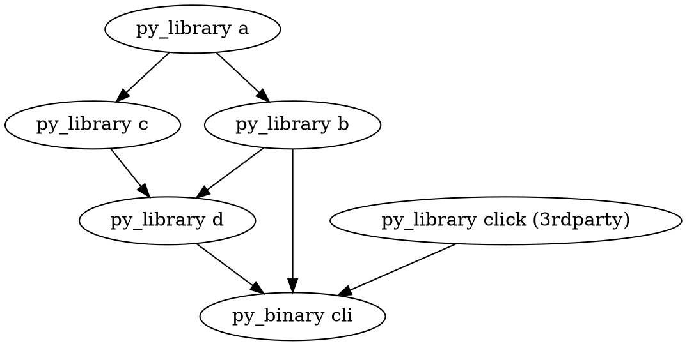

# Using MyPy with rules_python

This is a walkthrough of using [rules_mypy](https://github.com/theoremlp/rules_mypy) together with `rules_python` to apply typechecks as part of "building" a Python application.

## How MyPy will work

Bazel's [aspects](https://bazel.build/extending/aspects) allow extensions to traverse the build graph and apply rewrites to it between the analysis pass and before `build` happens.
A common application of aspects is to "bolt on" behavior to existing rules without having to modify them.
Which is exactly what we're going to do here.

One way that an aspect can extend an existing rule is by adding an [`OutputGroupInfo`](https://bazel.build/versions/7.4.0/rules/lib/providers/OutputGroupInfo) provider to the rule.
Output groups are a slightly unusual feature which allows for rule names to be overloaded, and for a rule to provide multiple kinds of outputs.
To take a slightly familiar example, the `py_binary` rule normally outputs a launcher script and a `.runfiles` tree, but it also provides a zipapp output which can be selectively enabled.
Outputs may be selected during a build using the [`--output_groups`](https://bazel.build/reference/command-line-reference#flag--output_groups) flag.

Notionally how this will all work is that:

- We need to create an aspect configured to use whatever `mypy` tool we may want
- That aspect will extend the `py_*` rules in the build graph to add an output group capturing the MyPy typecheck cache.
  These typecheck cache outputs will depend on the typecheck cache outputs of all dependencies.
- We will configure our `.bazelrc` to apply the aspect so that users don't have to think about it.
- We will configure our `.bazelrc` to select the typecheck output group in addition to the default outputs of rules.

This all has the effect of creating a build sub-graph parallel to our normal build graph which instead of producing and consuming Python files as dependencies produces and consumes the MyPy analysis caches.

To take a simple example, let's say that we have a small build graph

Ordinarily the dependencies between these rules take the form of the Python source files underlying the rules.
But when we activate our `mypy` aspect and select the `mypy` output group, the cache files from typechecking each* of these targets also become part of that dependency chain.
This allows Bazel to drive typechecking these libraries in depgraph order while caching intermediate results.

We can demonstrate this by looking at the results of `bazel aquery`, which will show MyPy invocations and that the resulting cache trees are dependencies between each of the invocations.
But more on that in a minute.

## Setup
